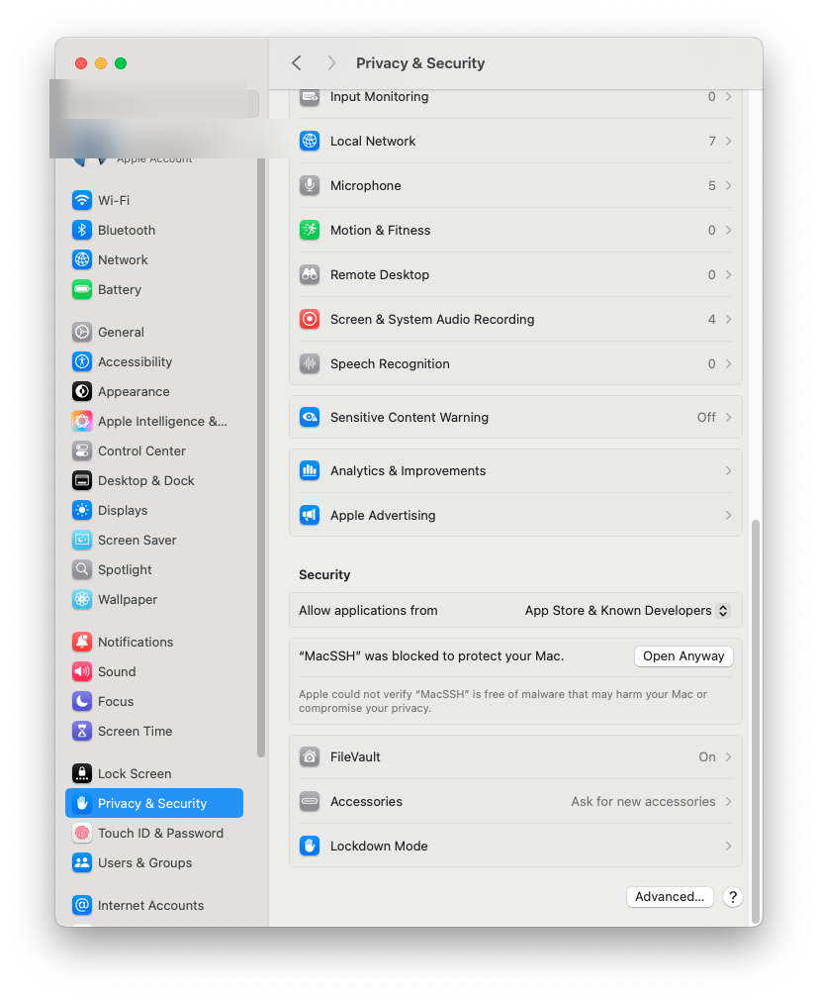
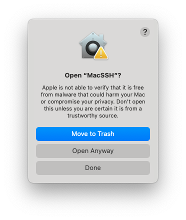

# MacSSH - Installation Guide

## Overview

MacSSH is a professional SSH client for macOS with built-in SwiftTerm terminal. The application is not signed with Apple Developer ID, so macOS may block its launch. This guide will help you safely install and run the application.

## System Requirements

- macOS 14.0 or newer
- ARM64 (Apple Silicon) and x86_64 (Intel) support
- Minimum 100 MB free space

## Installation

### Step 1: Download and Install

1. Download the `.dmg` file with the latest version of MacSSH
2. Double-click the `.dmg` file to mount it
3. Drag the `MacSSH` application to the `Applications` folder
4. Eject the disk and delete the `.dmg` file

### Step 2: First Launch and Gatekeeper Bypass

On first launch, macOS will show a security warning. This is normal for applications not signed with Apple Developer ID.

#### Option A: Through System Settings (Recommended)

1. **Open System Settings** → **Privacy & Security**
2. Find the section **"MacSSH" was blocked to protect your Mac**
3. Click the **"Open Anyway"** button
4. In the dialog that appears, select **"Open Anyway"**
5. Enter administrator password to confirm



#### Option B: Through Finder

1. Find the `MacSSH` application in the `Applications` folder
2. **Control+click** (or right-click) on the application
3. Select **"Open"** from the context menu
4. Click **"Open"** in the confirmation dialog

### Step 3: Launch Confirmation

After clicking "Open Anyway", a final confirmation dialog will appear:



1. Click **"Open Anyway"** (not "Move to Trash")
2. Enter administrator password
3. The application will launch

## Security

### Why does macOS block the application?

- **Gatekeeper** - macOS security system that verifies application signatures
- MacSSH is not signed with Apple Developer ID (costs $99/year)
- This **does not mean** the application is malicious

### How to verify security?

1. **Open source code** - you can check the code on GitHub
2. **Local build** - application is built from source code
3. **No network requests** - application doesn't send data
4. **SSH connections only** - uses standard protocols

## Troubleshooting

### Application won't launch

1. Make sure you clicked **"Open Anyway"**, not **"Move to Trash"**
2. Check settings in **System Settings** → **Privacy & Security**
3. Try reinstalling the application

### "Damaged" or "corrupted" error

1. Remove the application from `Applications`
2. Download again from GitHub
3. Follow the installation instructions

### Permission issues

1. Open **System Settings** → **Privacy & Security**
2. Find MacSSH in the permissions list
3. Enable necessary permissions (network, files, etc.)

## Alternative Installation Methods

### Via Homebrew (for developers)

```bash
# Clone the repository
git clone https://github.com/your-username/MacSSH.git
cd MacSSH

# Build the project
xcodebuild -project MacSSH.xcodeproj -scheme MacSSH -configuration Release build

# Copy to Applications
cp -R build/Release/MacSSH.app /Applications/
```

### Via command line (for advanced users)

```bash
# Temporarily disable Gatekeeper (development only!)
sudo spctl --master-disable

# Launch the application
open /Applications/MacSSH.app

# Re-enable Gatekeeper
sudo spctl --master-enable
```

## Support

If you encounter installation issues:

1. Check [Issues on GitHub](https://github.com/your-username/MacSSH/issues)
2. Create a new Issue with problem description
3. Attach error screenshots

## Updates

When updating the application, you may need to repeat steps 2-3, as macOS may block the new version again.

---

**Note**: This guide is intended for users who trust the application's source code. If you have security concerns, do not install the application.
