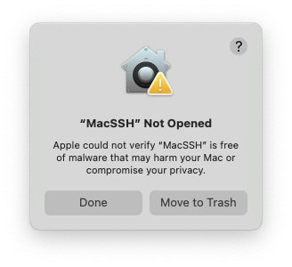

# MacSSH - Installation Guide

## Overview

MacSSH is a professional SSH client for macOS with built-in SwiftTerm terminal. The application is not signed with Apple Developer ID, so macOS may block its launch. This guide will help you safely install and run the application.

## Installation

### Step 1: Download and Install

1. **Download** the `.dmg` file from [GitHub Releases](https://github.com/Solvetronix/MacSSH/releases)
   - Go to the latest release
   - Download `MacSSH-vX.X.X.dmg` file
2. Double-click the `.dmg` file to mount it
3. Drag the `MacSSH` application to the `Applications` folder
4. Eject the disk and delete the `.dmg` file

### Step 2: First Launch - Gatekeeper Warning

When you first try to launch MacSSH, macOS will show this security warning:

**Don't click "Move to Trash"** - this is normal for unsigned applications.

**Click "Done"** to close this dialog.

### Step 3: Open System Settings

1. Go to **System Settings** → **Privacy & Security**
2. Scroll down to find the security section
3. You'll see: **"MacSSH" was blocked to protect your Mac**

### Step 4: Click "Open Anyway"

1. Click the **"Open Anyway"** button next to the MacSSH warning
2. A confirmation dialog will appear

### Step 5: Final Confirmation

In the final dialog, click **"Open Anyway"** (not "Move to Trash"):

3. Enter your administrator password when prompted
4. MacSSH will launch successfully

## That's It!

Your MacSSH application is now installed and ready to use. You may need to repeat steps 2-5 when updating to new versions.

## Security Note

This warning appears because MacSSH is not signed with Apple Developer ID ($99/year). The application is safe - it's open source and only makes SSH connections.

## Support

- Check [GitHub Issues](https://github.com/Solvetronix/MacSSH/issues)
- Create a new Issue if you have problems
